# Evaluation Plots Index

Auto-generated by `scripts/generate_eval_plots.py`. All plots at 300 DPI. Click thumbnails for full size.

## RDD (in-distribution)

### Stage1 Accuracy

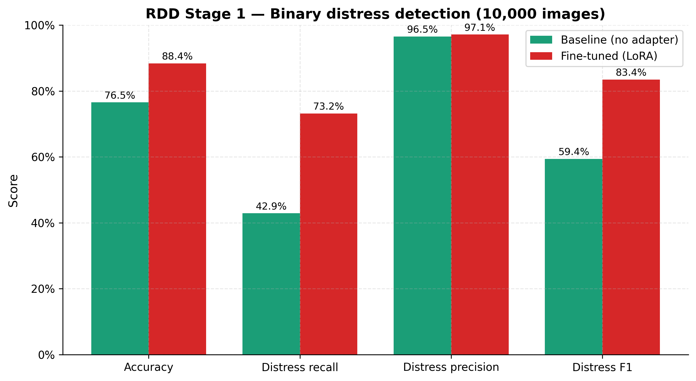

### Stage2 Per Class Recall

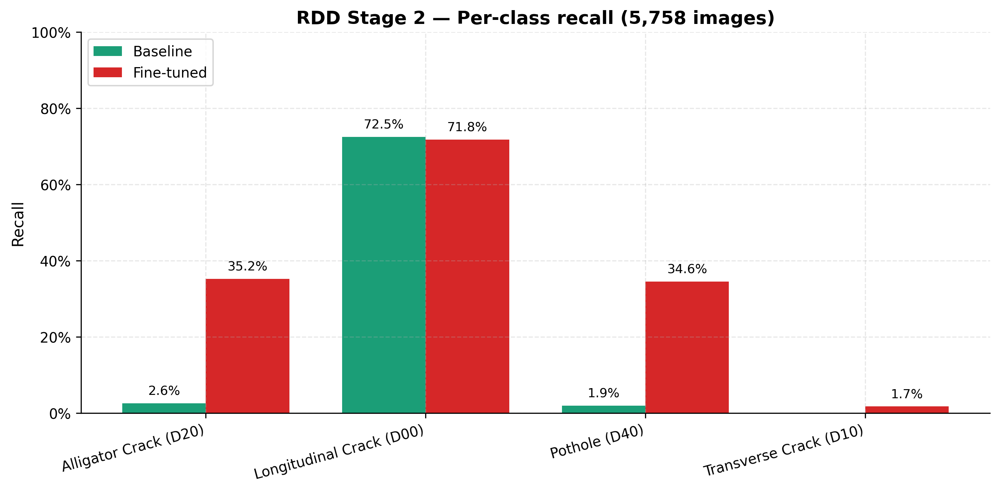

### Stage1 Confusion Matrices

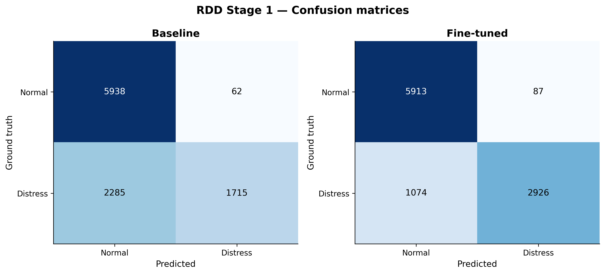

### Ab Promotion Gate

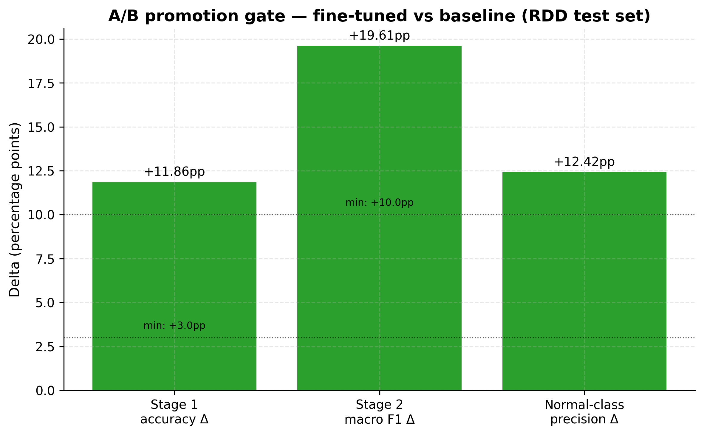

## Bengaluru (real-world)

### Status Distribution

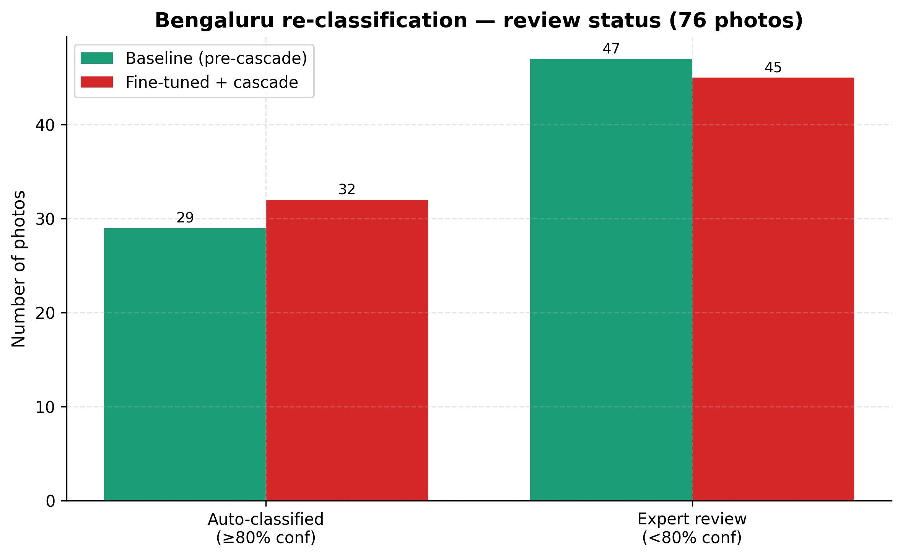

### Stage1 Transitions

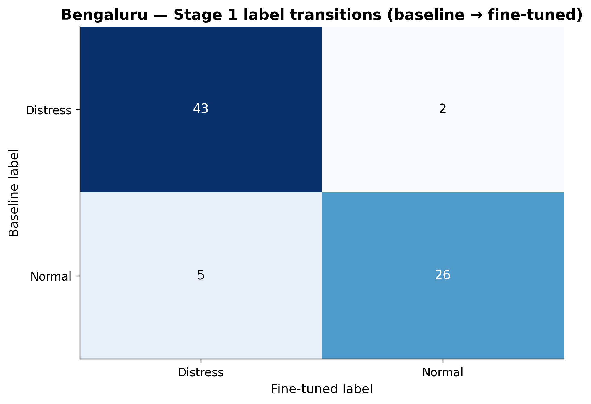

### Review Flag Flips

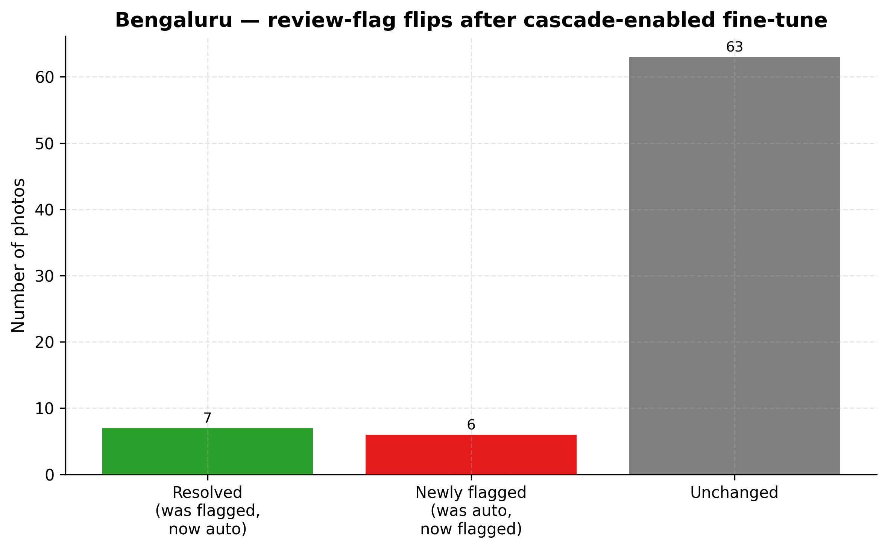

### Severity Transitions

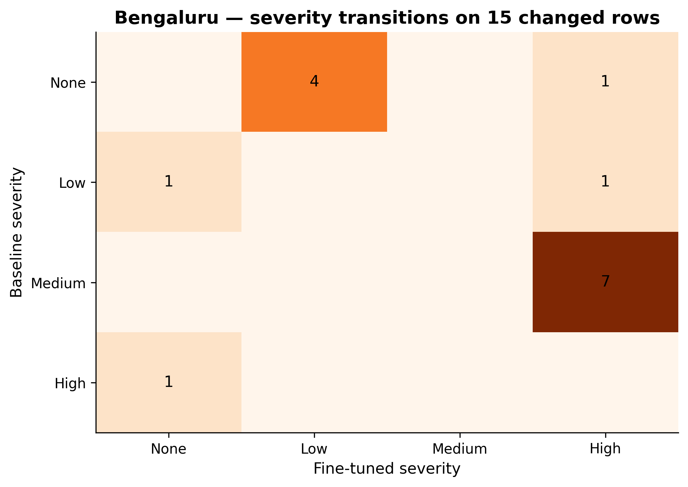

### Type Change Frequency

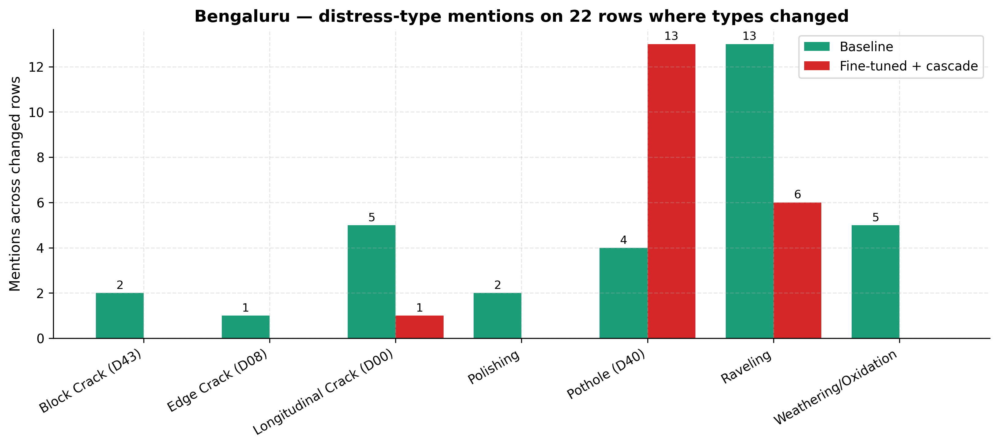

## Attain (cross-dataset)

### Tier Accuracy

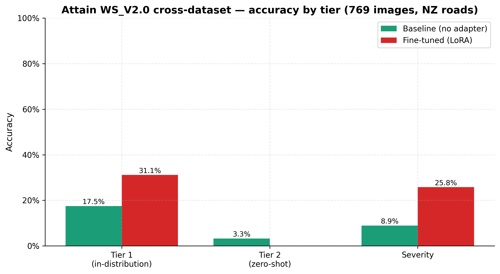

### Per Class F1

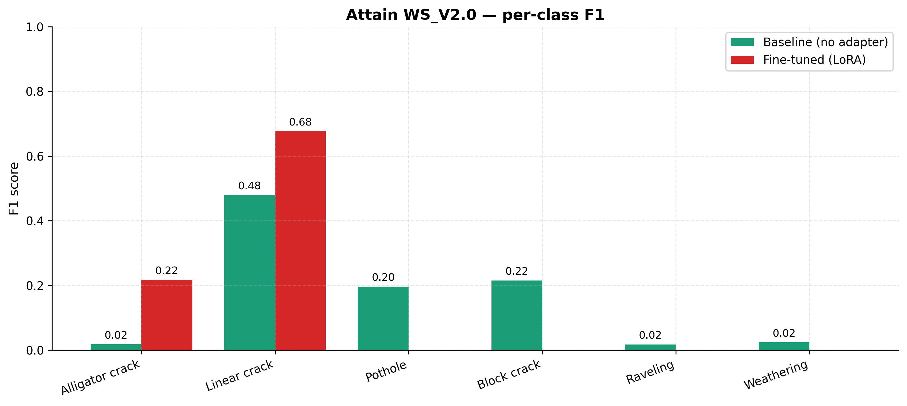

### Per Class Tp Fp Fn

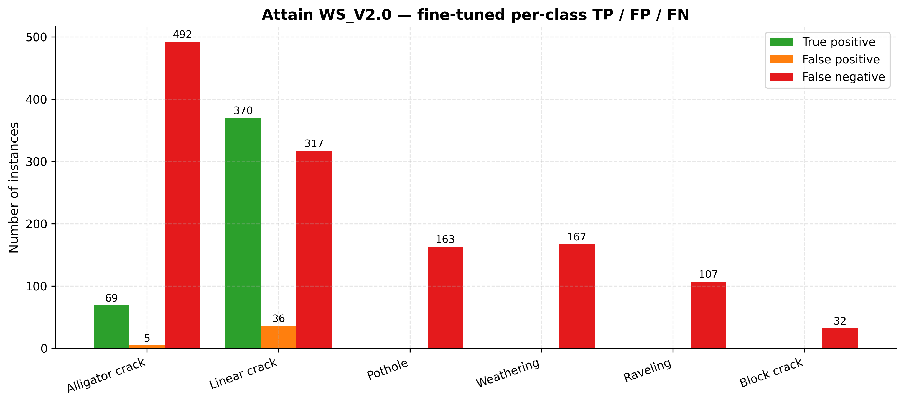

### Pothole Bias

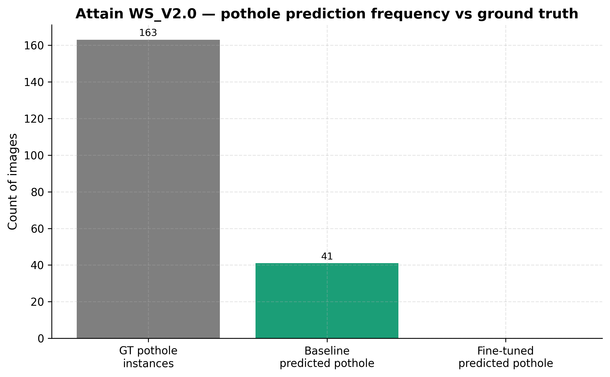

### Label Frequency

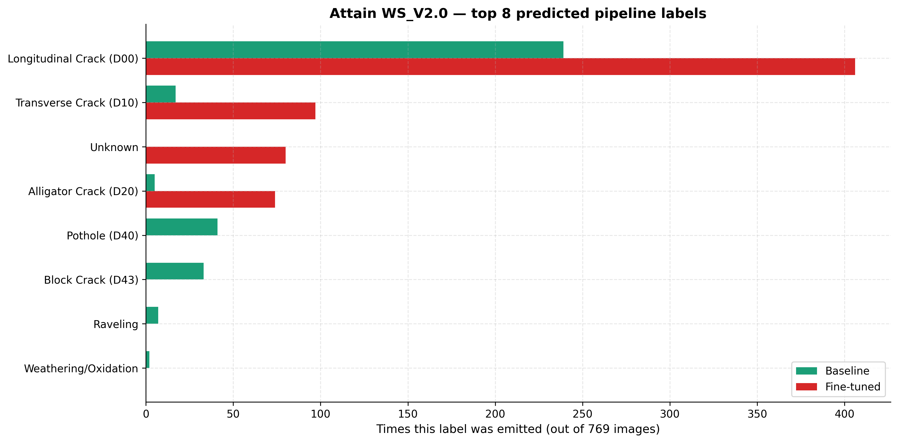

### Stage1 Detection Rate

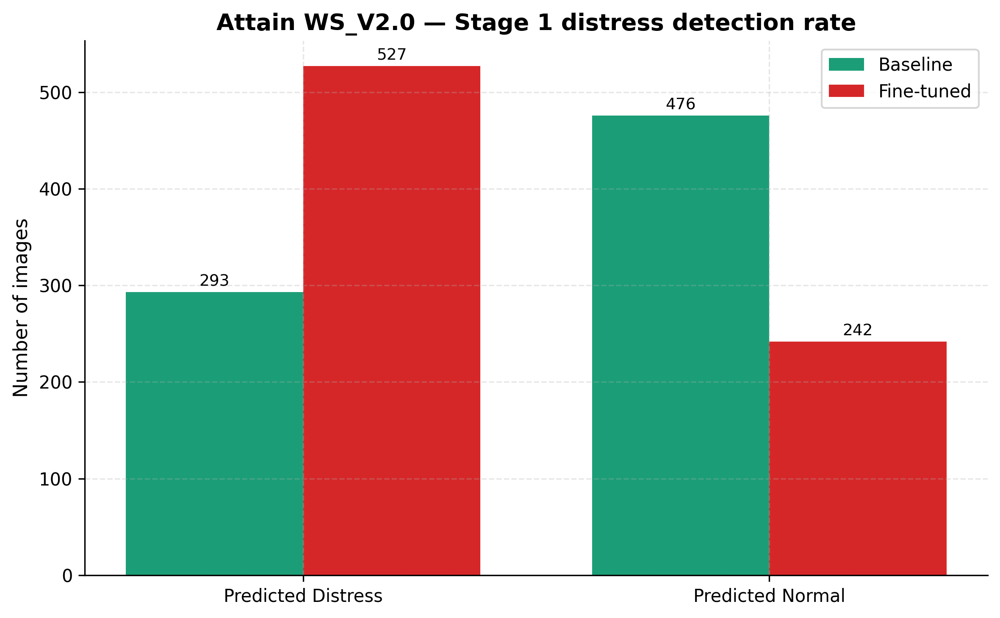

### Severity Distribution

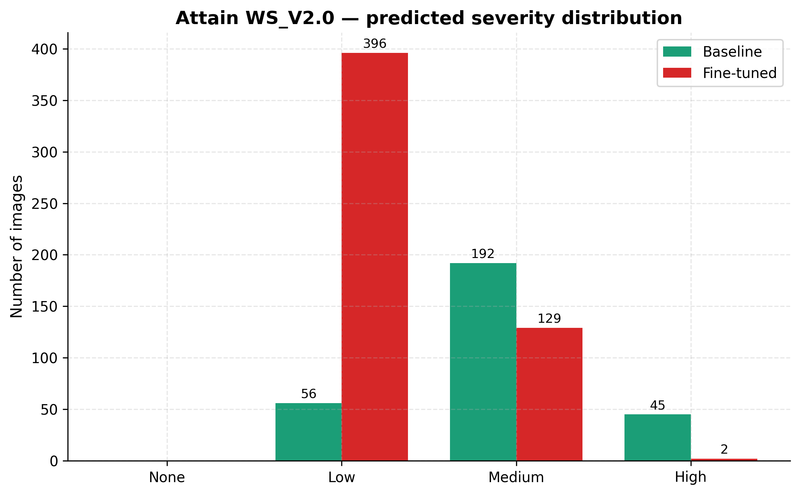

### Head To Head

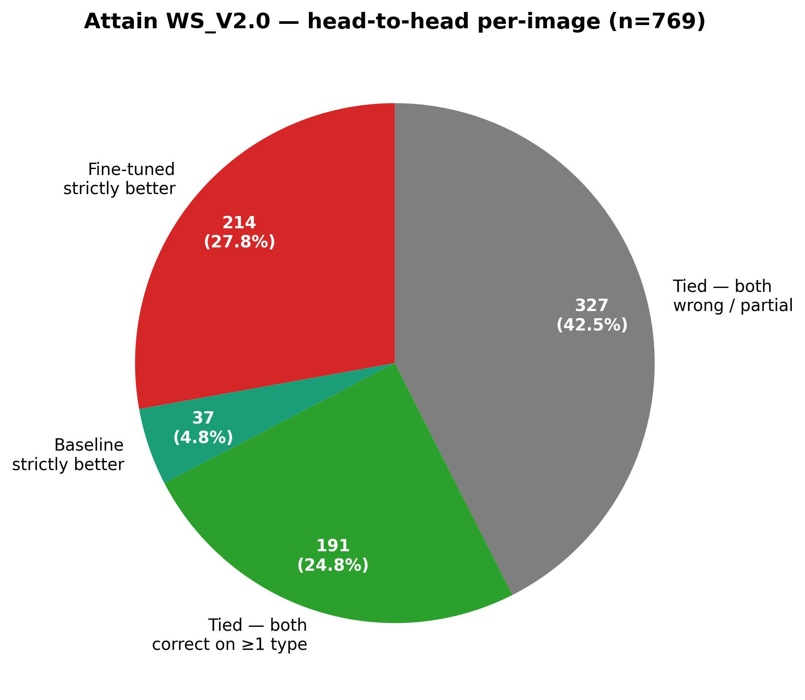

### Per Class F1 Delta

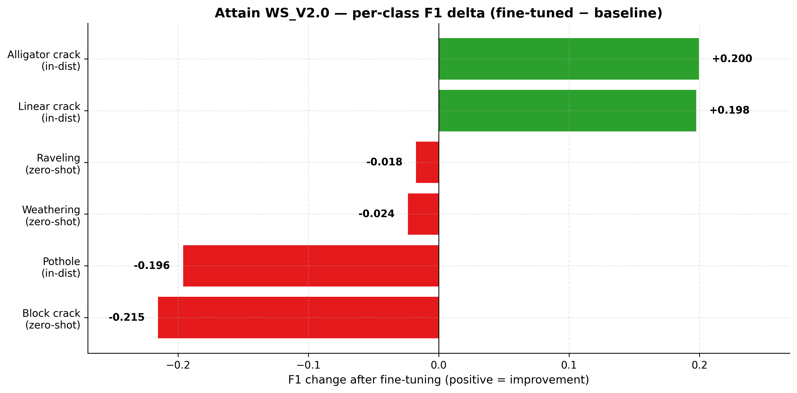
